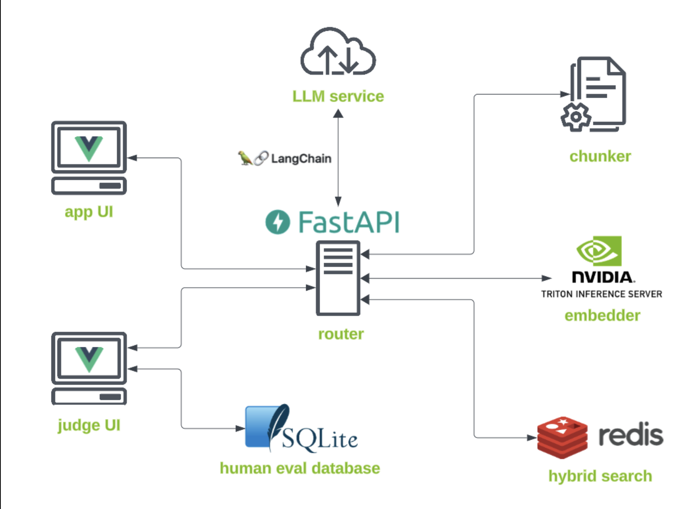

# Techniques-for-Improving-the-Effectiveness-of-RAG-Systems

Project : Techniques for Improving the Effectiveness of RAG Systems (NVIDIA Deep Learning Institute)

1. Built a real-world, production-grade, search and summarize RAG application.
2. Deployed several orchestrated microservices managing a variety different RAG application needs.
3. Employed a variety of chunking techniques to best prepare your data for a RAG application
4. Evaluated the RAG pipeline's performance with human-as-a-judge and LLM-as-a-judge techniques

Technologies/Tools Used:

1. NVIDIA NIMs
2. LangChain
3. Redis
4. NextJS
5. FastAPI
6. Docker Compose
7. TensorRT

Benchmark metrics used: Precision/Recall  
Evaluation techniques used: LLM-as-a-judge and human-as-a-judge

Final UI:

